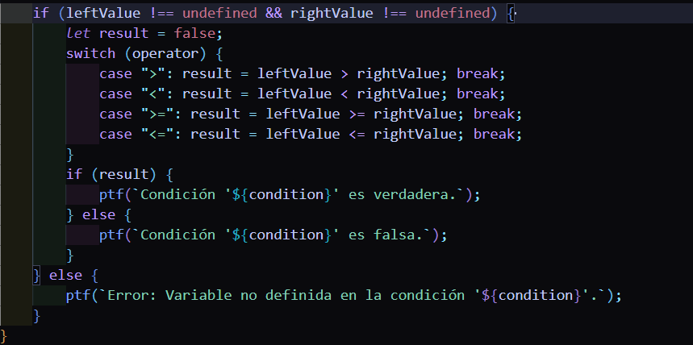

# Configuración del evento clic

# Obtención y limpieza de entradas
### Obtiene el código ingresado por el usuario
### consoleOuput muestra la salida.

# Daclaración de variables globales
### Este objeto se usa para almacenar las variables.

# Función ptf
### Agrega un texto a la salida y termina con un salto de línea.

# Función principal evaluateCode
### Se divide el código en un arreglo, en donde cada elemento representa una línea de texto.

# Recorrido de líneas
## Se eliminan los espacios en blanco al inicio y al final

# Manejo de ptf
* Detecta si una línea es una llamada ptf
* Y extrae el contenido de los paréntesis

* Luego divide el contenido por el operador + para manejar concatenaciones

* Cada fragmento part se evalúa:
* Si está entre **comillas** --> se extrae el texto
* Si es una **variable válida** --> se obtiene su valor
* Si es una variable del **0 al 9** --> Se añade como número
* Si **no cumple** con ninguna de estas condiciones --> Se lanza un error indicando que la variable **no está definida**
* Finalmente el resultado se imprimie usando **ptf**

# Declaración de variables

* Se verifica si la línea comienza con un **int**
* Divide la línea por el símbolo **=** para separar el nombre de la variable y su valor.

* Se extrae el nombre de la variable validando que sea una letra de la **a - z** o que el valor esté entre **0 - 9**
* En caso de error manda un mensaje con ptf

# Condicional if
* Detecta condiciones con la palabra clave if
* Extrae la condición entre paréntesis

* Se evalúa la condición para los operadores **<, >, <=, >=**
* Divide  la condición en partes **(izquierda, operador, derecha)** y las evalúa:

* Convierte cada lado en números o busca en las variables definidas

# Si ambas partes son válidas
* Si la condición es verdadera, imprime un mensaje indicando el resultado

# Código procesado
## Al finalizar, la función procesa todo el código ingresado y muestra los resultados en consoleOuput.

> Esto es Simplexito